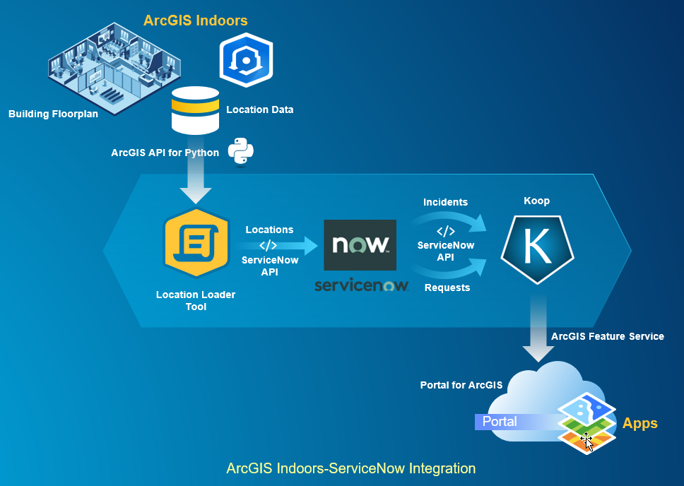

# indoors-servicenow-feature-service
This is a complete integration solution for ArcGIS Indoors with ServiceNow application. This repo provides software tools required to populate ServiceNow location model and expose incidents and requests data on ArcGIS platform through a rest feature service. The figure below illustrates the flow of location data from ArcGIS Indoors Information model to ServiceNow and to ArcGIS clients through Koop.

This repo also provides steps to configure 311 button on ArcGIS Indoors app to launch ServiceNow incident or request form and automatically populate form fields with location data and other values as specified in the URL scheme.

## Features
- `python-loader`: Loads ArcGIS Indoors location data in ServiceNow location model.
-	`koop-provider`: Provides ServiceNow incidents and requests location through a feature service.
-	`311`: Launch ServiceNow incident or request form from ArcGIS Indoors 311 button.

## Issues
Find a bug or want to request a new feature? Please let us know by submitting an issue.

## Contributing
Anyone and everyone is welcome to contribute.

## Licensing
Copyright 2019 Esri
Licensed under the Apache License, Version 2.0 (the "License"); you may not use this file except in compliance with the License. You may obtain a copy of the License at
http://www.apache.org/licenses/LICENSE-2.0
Unless required by applicable law or agreed to in writing, software distributed under the License is distributed on an "AS IS" BASIS, WITHOUT WARRANTIES OR CONDITIONS OF ANY KIND, either express or implied. See the License for the specific language governing permissions and limitations under the License.
A copy of the license is available in the repository's LICENSE.txt file.

